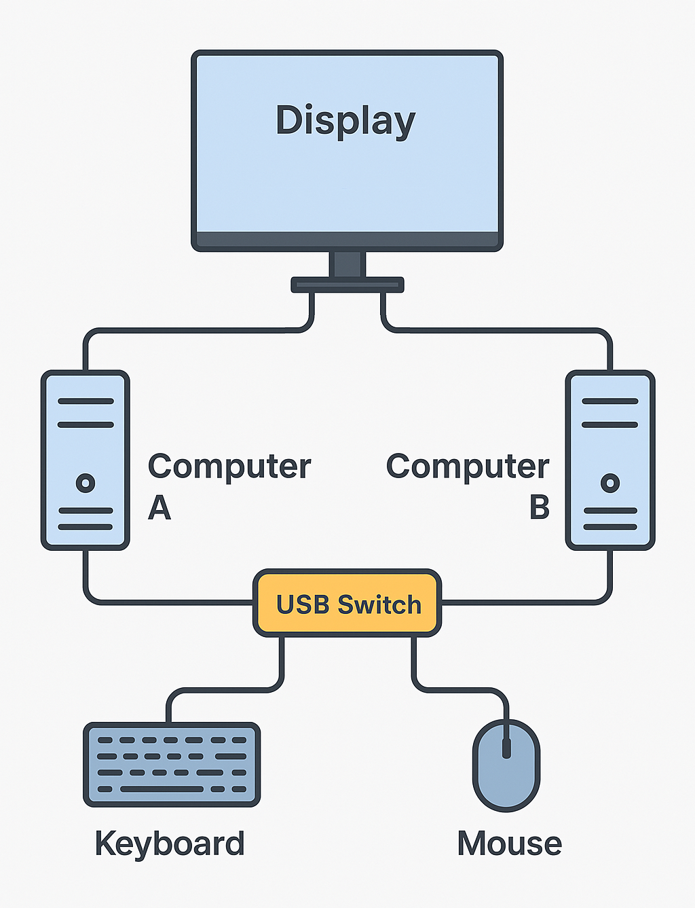

[](https://github.com/matushorvath/shadow-kvm/actions/workflows/build.yml)
[](https://github.com/matushorvath/shadow-kvm/releases/latest)

# Shadow KVM

Shadow KVM is a Windows application that enhances a basic USB switch to function like a full KVM switch.
It automatically switches your monitor inputs based on which computer currently has the keyboard or mouse attached.

## Use Case

If you have multiple computers connected to the same display and a USB switch for your keyboard and mouse,
Shadow KVM will automatically switch your display input when you change the USB switch to a different machine.

<!--  -->


## Installation & Usage

Download and install the current [ShadowKVM release](https://github.com/matushorvath/shadow-kvm/releases/latest). First time you start Shadow KVM, it will ask you to generate a new config file:


The config file will be based on monitors connected to your machine, to give you a starting point for tuning your Shadow KVM setup. There is no configuration user interface, instead Shadow KVM will open the config file in a text editor:


The config file contains additional useful information on how to configure Shadow KVM.
Once you are finished editing the config file, save it and close the editor. Shadow KVM will reload the config file automatically after the editor is closed.

### Trigger Device

The first thing you need to configure is the `trigger-device` property. Shadow KVM will switch monitor inputs whenever the trigger device is connected or disconnected.

The default choice is `keyboard`, which means every time a keyboard is connected or disconnected to your computer, Shadow KVM will also switch your monitor inputs.

```yaml
trigger device:
    class: keyboard
```

You can choose to use a mouse instead of a keyboard for this. Optionally you can also choose a specific keyboard or mouse based on the Vendor ID and Product ID. This is useful if you have more than one keyboard or mouse attached, and you want just one of those devices to trigger Shadow KVM. See documentation in the config file more more details.

```yaml
trigger device:
    class: mouse
    vendor-id: 2f68
```

The vendor and product ids can be found in Shadow KVM logs (see below).

### Monitors

The second thing you need configure is the `monitors` section. This is pre-filled by ShadowKVM based on the monitors you have attached to your computer.

You still need to configure which monitor input your computers are connected to. This is configured in the `attach` and `detach` sections:

```yaml
monitors: 
  - description: Dell S2722QC(HDMI1)
    adapter: NVIDIA GeForce RTX 3050
    serial-number: 7XTBLZ3
    attach:
      code: input-select
      value: hdmi1
    detach:
      code: input-select
      value: 27    # other options: analog1, hdmi2
```

In this example, whenever your chosen trigger device (keyboard or mouse) is attached to the computer, Shadow KVM will tell your monitor to select the HDMI1 input. Whenever that trigger device is detached from the computer, ShadowKVM will tell your computer to select the "27" input.

You can see all inputs your monitor supports in the "other options" comment. You will need to edit the `value` setting for both `attach` and `detach` to match monitor inputs where your computers are connected.

The "27" input in this example does not have a nice name like "hdmi2" or "analog1". That could happen for input types too recent to have a human readable name assigned in the DDC/CI standard. If you see a numbered input, check the inputs in your monitor's OSD menu and try to map them to the values detected by Shadow KVM.

For example, in this case the monitor's OSD menu lists VGA, HDMI1, HDMI2 and USB-C inputs. This suggests that `analog1` refers to the analog VGA input, `hdmi1` and `hdmi2` are obviously HDMI1 and HDMI2, and `27` must refer to the relatively recent USB-C input, since it's the only value left unmapped.

### Controlling Shadow KVM

Shadow KVM displays an icon in the system notification area ("tray icon"), with a menu you can use to control Shadow KVM.


You can temporarily disable or enable Shadow KVM. When disabled, it does not react to you connecting or disconnecting a keyboard or mouse. You can also configure it to start automatically after logon, and display and edit the config file.

### Additional Information

The config file supports more than one monitor, in case you have more than one monitor connected to your computers. It does currently only support one trigger device.

The config file is located in your user profile: `C:\Users\<username>\AppData\Roaming\Shadow KVM\config.yaml`  
Log files are also stored there, and they contain additional information you may find useful when troubleshooting.

If you would like Shadow KVM to regenerate the default config file, exit Shadow KVM, delete the config file, and restart Shadow KVM. It will ask you to generate the default config file again.

## Requirements

- Windows 10.0 or newer
- Monitors that support DDC/CI for input switching
- A USB switch with a connected keyboard and/or mouse

## How It Works

- Listens for USB keyboard connections using the Windows `CM_Register_Notification` API.
- When a new keyboard is detected, it determines which computer is currently active.
- Uses the DDC/CI protocol (`SetVCPFeature`) to switch the display input to the corresponding computer.
- Ensures seamless transitions between multiple machines connected to the same monitors.

## Third-Party Work

This project uses [H.NotifyIcon](https://github.com/HavenDV/H.NotifyIcon) to display a tray icon.
The tray icon handling code is partly based on an
[example](https://github.com/HavenDV/H.NotifyIcon/tree/master/src/apps/H.NotifyIcon.Apps.Wpf)
that is part of H.NotifyIcon source code.

This project includes the [Shadow Icon](https://icon-icons.com/icon/shadow/264912) by Mingcute,
licensed under the [Apache License 2.0](https://www.apache.org/licenses/LICENSE-2.0).
The icon was modified by adjusting the colors.

## Release Process

1. Prepare the release in `main` branch.
1. Tag the commit with the version number.
   ```sh
   $ git tag v0.1.0 main
   ```
1. Push the tag to GitHub.
   ```sh
   $ git push origin tag v0.1.0
   ```
1. GitHub Actions will run and prepare a release draft for the tag.
1. Edit the release draft to add release notes and publish the release.

## License

[MIT License](https://opensource.org/license/mit)  
(see [NOTICE.md](Installer/Notice.md) for details)
